README For SuperCapControl

超级电容 ultracapacitor

@Rodeson

Email：lds947003754@outlook.com

## 0.超级电容图片说明

### 控制板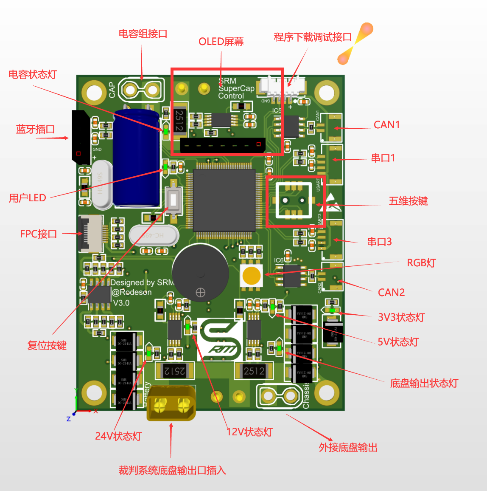

### 功率板

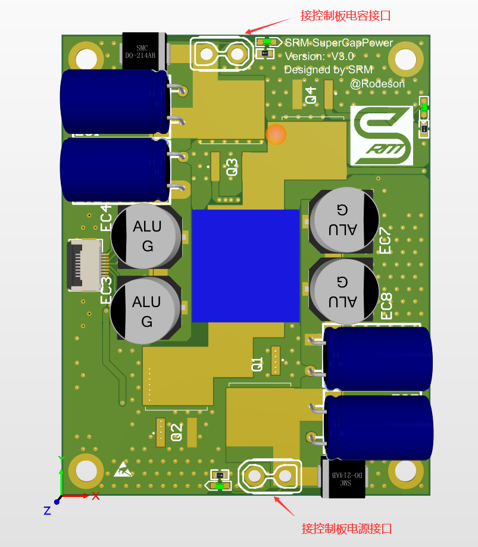

## 1.超级电容硬件说明

1. 使用4Buckboost电路，实现升降压控制。
2. 将控制板和功率板进行拆分设计，两个板子对应接口固定，PWM控制线通过FPC排线连接，电源接口使用XT30接口连接。
3. 更改设计后，V2.0板子实际面积更小，在舵轮上安装方便。
4. 在实际使用过程中，为方便了解超级电容工作状态，视觉上增加RGB灯显示板子工作情况，听觉上增加蜂鸣器，能够在工作异常时第一时间了解情况。
5. 传感器选型上使用ina240a1和opa2350ua，使用adc读取模拟信号，上一代超级电容使用ina226容易出现i2c通信掉线情况。
6. 增加板载温度传感器MCP9700AT-E_TT，监测超级电容工作温度。
7. PCB设计时，减小PCB上大电流走线距离，板载大电流开窗布线。
8. 增加可交互的五维按键和OLED显示屏，方便现场调参。


## 2.硬件设计

### 2.1 采样电路

2.1.1接口采样电路

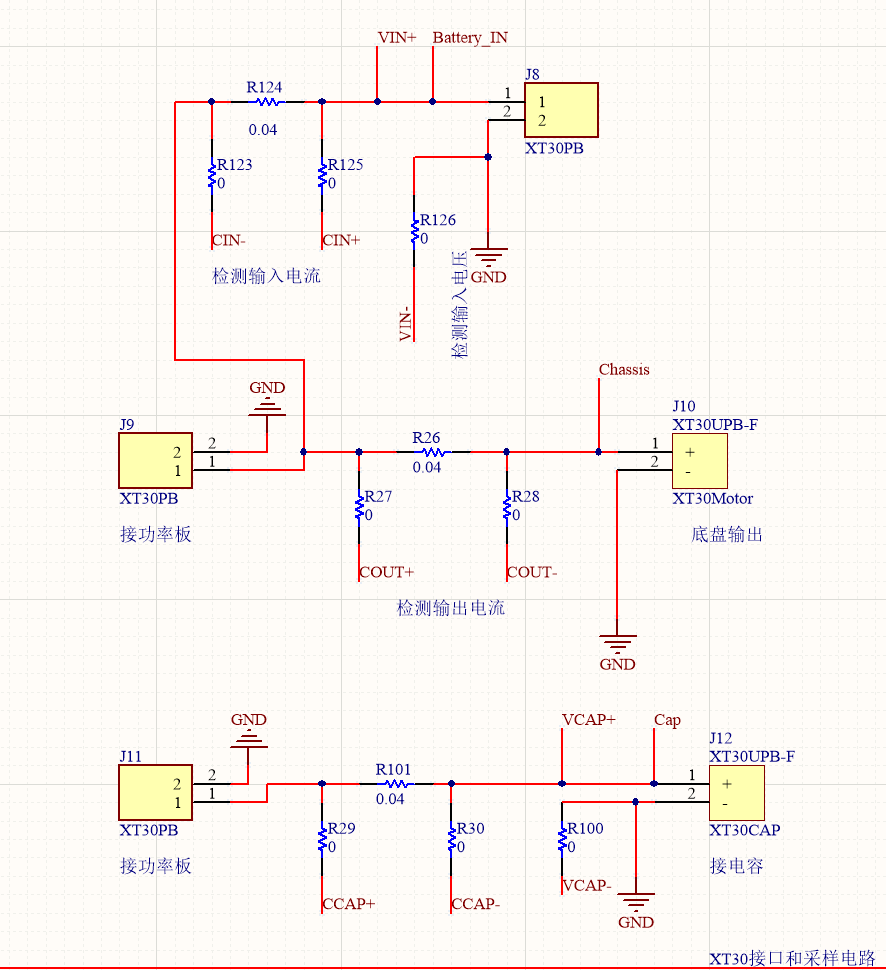

2.1.2电流传感器

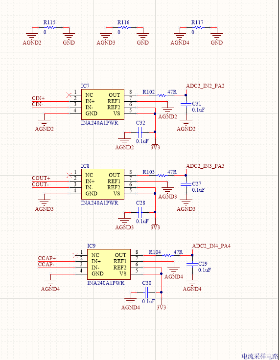

2.1.3电压传感器

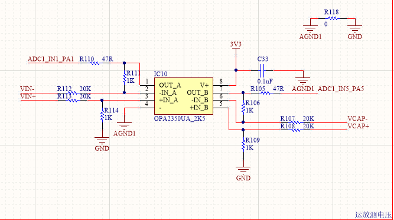

### 2.2 BuckBoost电路

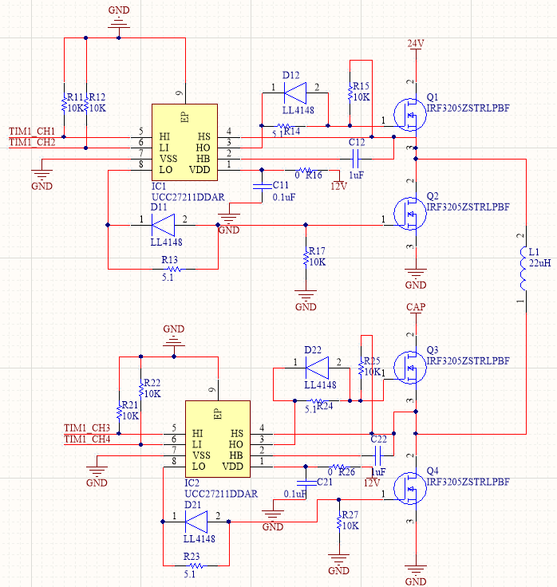

### 2.3供电路径

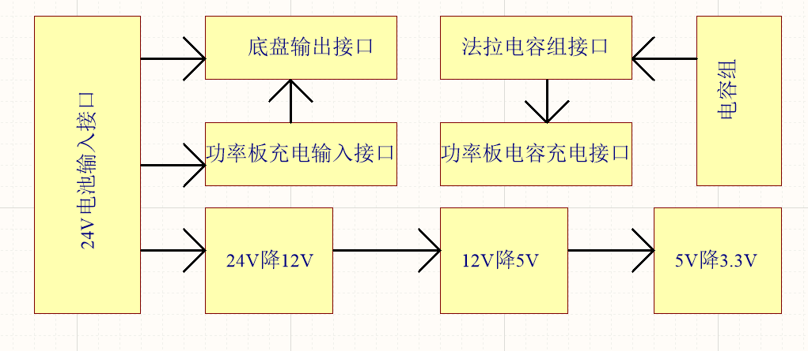

## 3.超级电容控制思路

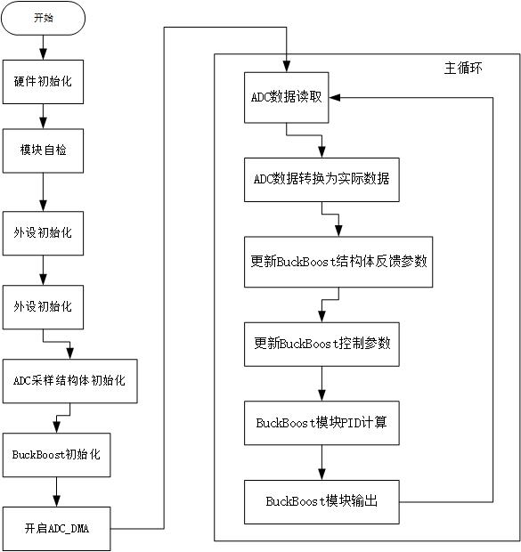

## 4.超级电容buckboost模块控制逻辑

### 4.1采样数据计算

```c
    battery_in.I_now = buckboost_control.BUCKBOOST_IN_C;
    battery_in.U_now = buckboost_control.BUCKBOOST_IN_V;
    battery_in.P_now = battery_in.I_now * battery_in.U_now;

    chassis_out.I_now = buckboost_control.BUCKBOOST_OUT_C;
    chassis_out.U_now = buckboost_control.BUCKBOOST_IN_V;
    chassis_out.P_now = chassis_out.I_now * chassis_out.U_now;

    dcdc_in.I_now = buckboost_control.BUCKBOOST_IN_C - buckboost_control.BUCKBOOST_OUT_C;
    dcdc_in.U_now = buckboost_control.BUCKBOOST_IN_V;
    dcdc_in.P_now = dcdc_in.I_now * dcdc_in.U_now;

    dcdc_out.I_now = buckboost_control.BUCKBOOST_CAP_C;
    dcdc_out.U_now = buckboost_control.BUCKBOOST_CAP_V;
    dcdc_out.P_now = buckboost_control.BUCKBOOST_CAP_C * buckboost_control.BUCKBOOST_CAP_V;
```

### 4.2串级PID思路

#### 4.2.1缓冲能量环

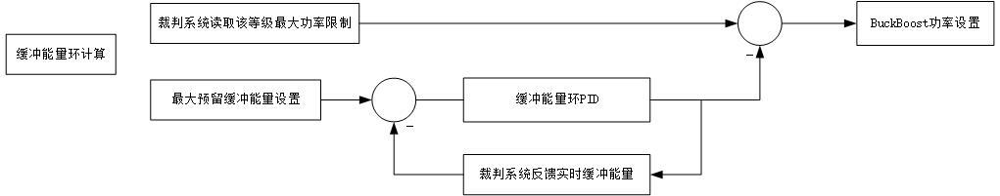

#### 4.2.2功率环

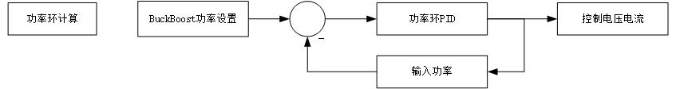

#### 4.2.3电压电流环

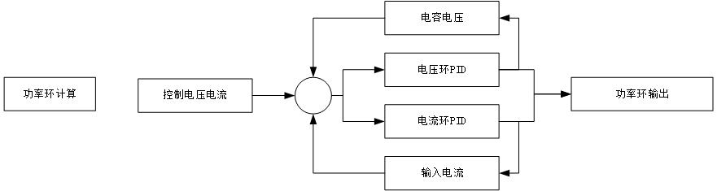

### 4.3输出设置

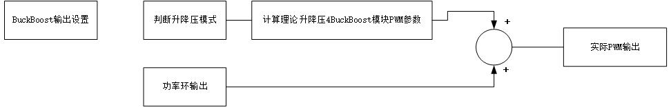

## 5.NMOS挂载情况

```c
/****************************
24V                 CAP
Q1------|     |------Q3
        |-----|
        |  L  |
        |-----|
Q2------|     |------Q4
*****************************/
#define Q1_PWMControl_TIM     htim1
#define Q1_PWMControl_TIM_CH  TIM_CHANNEL_1
#define Q2_PWMControl_TIM     htim1
#define Q2_PWMControl_TIM_CH  TIM_CHANNEL_2
#define Q3_PWMControl_TIM     htim1
#define Q3_PWMControl_TIM_CH  TIM_CHANNEL_3
#define Q4_PWMControl_TIM     htim1
#define Q4_PWMControl_TIM_CH  TIM_CHANNEL_4
```

## 6.BuckBoost控制 C语言结构体

```c
typedef struct
{
  uint8_t data_update;    //1更新
  uint8_t buckboostmode;  //0为初始关闭模式 1为降压模式 2为升压模式
  uint8_t loop_mode;      //环路模式0：cv 1：cc 2：cp
  float efficiency;       //总效率 ，热耗散
  uint8_t power_dir;      //能量方向0正向充电1反向放电
  uint16_t max_power_lim; //裁判系统最大功率
  float power_pass;       //  裁判系统花去功率板与板子测量误差经过pid结果用于传递
  uint8_t referee_power;
  uint8_t referee_buff;
  float powerbuffer ;     //缓冲能量
    
  PID_Regulator_t BuckBoostLoopCcompare_PID;//输出电流环
  PID_Regulator_t BuckBoostLoopVcompare_PID;//输出电压环
  PID_Regulator_t Robot_Buffer_PID;//缓冲能量环
  PID_Regulator_t Robot_Power_PID;//功率环
    
  
  double BUCKBOOST_CAP_C;
  double BUCKBOOST_CAP_V;
  double BUCKBOOST_IN_C;
  double BUCKBOOST_IN_V;
  double BUCKBOOST_OUT_C;
    
  double BUCKBOOST_NEED_C;
        
  float BUCKBOOST_IN_P;
  float BUCKBOOST_OUT_P;
  float BUCKBOOST_CAP_P;
  float BUCKBOOST_NEED_P;
  
  float charge_power;//功率环计算OUT
  float charge_current;// = charge_power/inV
  float cloop;
  float vloop;
  float ratio_pass;//计算升降压比例

  uint8_t POWER_LIMIT_MODE;//超级电容功率限制模式 0使用电容 1不使用电容
    
} BUCKBOOST_STRUCT;
```

## 7.超级电容模块通信协议

### 7.1CAN 发送程序参考

发送函数

```c
void supercap_sendmessage(uint16_t Vcap)
{
		static uint8_t supercap_tx_data[2];
	
		Tx1Message.StdId=0x211;
		Tx1Message.IDE =CAN_ID_STD;
		Tx1Message.RTR=CAN_RTR_DATA;
		Tx1Message.DLC =0x08;
		memcpy (supercap_tx_data, &Vcap, sizeof(Vcap));
		HAL_CAN_AddTxMessage(&hcan1, &Tx1Message, supercap_tx_data ,&pTxMailbox);
}
```

实例应用（发送超级电容电压数据 由于是无符号16位整数 因此需要将浮点数乘以1000并发送整数）

```c
supercap_sendmessage(buckboost_control.BUCKBOOST_CAP_V * 1000);
```

### 7.2CAN 接收程序参考

接收函数（接收裁判系统底盘参数 为当前等级底盘最大功率及实时缓冲能量）

```c
void get_supercap_measure(BUCKBOOST_STRUCT *cap, uint8_t aData[])
{
    cap -> referee_power  = aData[0];
    cap -> referee_buff  = aData[1];
}
```

实例应用（该函数 扔在can线接收中断里面）

```c
void CAN1_Getdata(CAN_RxHeaderTypeDef *pHeader,uint8_t aData[])
{
	switch (pHeader->StdId)
	{
		case 0x0210:
		{
			//得到超级电容数据
			get_supercap_measure(&buckboost_control,aData);
		}
		default:
		{
			
		}break;
	}
}
```

